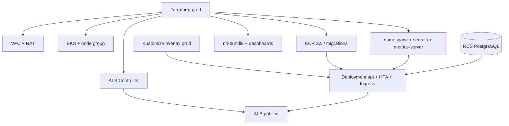

# infra-kubernetes — cluster e runtime da API

## Propósito

Provisiona a infraestrutura Kubernetes da oficina na AWS: VPC, EKS, ECR, ALB Ingress, namespace, secrets da API, Metrics Server, HPA e o módulo New Relic. É o repositório de Terraform do cluster exigido pelo Tech Challenge.

O ambiente vive no AWS Academy Learner Lab. O ritual de sessão (credenciais que expiram) está em [`docs/RUNBOOK-LAB.md`](docs/RUNBOOK-LAB.md).

## Tecnologias

- Terraform >= 1.5, providers `aws`, `kubernetes`, `helm`, `newrelic`
- Amazon EKS 1.33, VPC com NAT, ECR
- AWS Load Balancer Controller (Helm)
- Kustomize (`k8s/base` + `k8s/overlays/prod`)
- New Relic `nri-bundle`

Não há Dockerfile neste repositório.

## Pré-requisitos

- Terraform 1.15.x e AWS CLI
- `kubectl` e `kustomize`, para apply local
- Lab ligado e credenciais atualizadas
- **`infra-database` aplicado** — RDS PostgreSQL na VPC
- Secrets GitHub: `AWS_ACCESS_KEY_ID`, `AWS_SECRET_ACCESS_KEY`, `AWS_SESSION_TOKEN`, `DATABASE_URL`, `JWT_SECRET`, `SEED_ADMIN_PASSWORD`
- New Relic (opcional): `NEW_RELIC_LICENSE_KEY`, `NEW_RELIC_ACCOUNT_ID`, `NEW_RELIC_API_KEY`

A Lambda (`lambda-auth`) precisa desta VPC aplicada — ela descobre subnets pela tag `kubernetes.io/role/internal-elb`.

## Execução

```bash
pbpaste | ~/scripts/pos-fiap-new/sync-lab-credentials.sh
./scripts/tf-init.sh
terraform -chdir=terraform/environments/prod plan
terraform -chdir=terraform/environments/prod apply
```

Deploy dos manifests (migrations e depois a API):

```bash
aws eks update-kubeconfig --name tech-challenge-prod --region us-east-1
./scripts/deploy-k8s.sh
```

## Deploy

Push na `main` dispara [`Deploy Prod`](.github/workflows/deploy-prod.yml): `terraform apply`, patch das imagens ECR no overlay e `deploy-k8s.sh`.

Ordem de merge: `infra-database` → **este repo** → `app` → `lambda-auth`.

## Pipeline

| Workflow | Gatilho | O que faz |
|---|---|---|
| [`terraform-plan.yml`](.github/workflows/terraform-plan.yml) | PR para `main` | `fmt`, `validate`, `plan` |
| [`deploy-prod.yml`](.github/workflows/deploy-prod.yml) | push na `main` | `apply`, Kustomize, smoke no `/health/live` |

A `main` é protegida.

## Diagrama deste repositório



Visão completa: [componentes-nuvem](https://github.com/tech-challenge-pos-fiap-debora/app/blob/main/docs/diagrams/componentes-nuvem.md).

## APIs

Este repo não expõe REST próprio. A API publicada no Ingress é a do `app`:

- Swagger: `http://<dns-do-alb>/api`
- Health: `http://<dns-do-alb>/health/live`
